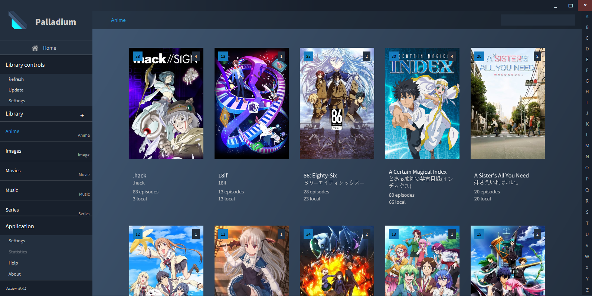

# O aplikaci Pallidium
Pallidium je bezplatná aplikace pro multimediální správu a zaměřuje se na přenositelnost, kompatibilitu a zálohování.
Svým uživatelům nabízí možnost organizace filmů, seriálů, hudby a obrázků do uživatelsky vytvořených knihoven. 
Každá taková knihovna shlukuje data spadající do své kategorie a nabízí různé nástroje pro jejich správu. 
Primární funkce aplikace dává svým uživatelům možnost souborové analýzy a analýzy ostatních metadat z TMDB API. 
Data souborové analýzy jsou získána pomocí nástrojů FFprobe a ExifTool.
Knihovní úložiště je řešeno pomocí databáze SQLite.

Aplikace je inspirována ostatními konkurentními produkty jako jsou Plex, Kodi a Emby.
Oproti nim přináší nižší nároky na celkovou kapacitu a tím lepší možnost zálohování.
Aplikace je plně kompatibilní na zařízeních se systémy Windows 7 až Windows 11 a je nutné ji naistalovat pomocí instalačního .msi souboru.
Vytvořené soubory knihoven jsou plně kompatibilní, přenosné a spustitelné touto aplikací na jiných zařízeních.
Soubory jsou dále v otevřeném a dostupném formátu a nabízí tak transparentnost z pohledu uložených dat.

Aplikace dále nabízí možnost propojení s webovým portálem [Pallidium](https://pallidium.cz).
Propojení nabízí možnost synchronizace vytvořených knihoven do uživatelského účtu a umožňnuje tak sledovat svá hodnocení a knihovny (seznamy) z různých zařízení.
Změny provedené ve webovém prostředí lze také lehce synchronizovat zpět do lokální kníhovny v rámci desktopové aplikace.
Záhájit spuštění oblíbených filmů a seriálů lze také z prostředí prohlížeče v případě, že desktopová aplikace běží na pozadí.
Vytvořené knihovny lze dále sdílet ostatním zpřáteleným uživatelům.

# About Pallidium
Pallidium is a free multimedia management application and focuses on portability, compatibility and backup.
It offers its users the opportunity to organize movies, series, music and pictures into user created libraries. 
Each such library aggregates data that falls into its category and offers various tools for their management. 
Primary function gives its users the ability to analyze files and other metadata using the TMDB API. 
Metadata from file analysis is obtained using the FFprobe and ExifTool tools.
The library storage is solved using the SQLite database.

The application is inspired by other competing products such as Plex, Kodi and Emby.
In contrast, it brings lower demands on the total capacity and thus a better backup option.
The application is fully compatible with devices running Windows 7 to Windows 11 and has to be installed via provided .msi installer.
Created library files are fully compatible, portable and loadable by this application on other devices.
The files are in an open and accessible format, offering transparency in terms of the stored data.

The application also offers the option to connect with the [Pallidium](https://pallidium.cz) web portal.
This integration allows users to sync their created libraries with their account, enabling them to track their ratings and libraries (lists) across different devices.
Changes made in the web environment can also be easily synced back to the local library within the desktop application.
It is also possible to start playing favorite movies and TV shows from the browser environment if the desktop application is running in the background.
Created libraries can also be shared with other connected users.

# Instalace / Installation
Aplikaci lze získat stažením nejnovější verze z [Releases](https://github.com/pPetrBednar/pallidium/releases).
Archiv přenosné verze je nutné extrahovat a samotnou aplikaci je možné spustit přes Pallidium.exe.
V případě využití instalátoru .msi je aplikace nainstalována pod aktuálního uživatele a dostupná v nabídce aplikací na spuštění i odinstalaci.
Aplikace nevytváří žádné vlastní registry a je uložena pod aktuálním uživatelem ve složce "/AppData/Local/Pallidium".

The application can be obtained by downloading the latest version from [Releases](https://github.com/pPetrBednar/pallidium/releases).
The portable version archive needs to be extracted, and the application can be launched via Pallidium.exe. 
If using the .msi installer, the application is installed for the current user and is available in the applications menu for both launching and uninstalling. 
The application does not create any custom registry entries and is stored under the current user in the "/AppData/Local/Pallidium" folder.

# Ukázka aplikace / Application showcase
Ukázka několika snímků přímo z aplikace. Více snímku je k dispozici v repositářové složce "showcase".

A sample of several images directly from the application. More images are available in the "showcase" repository folder.
## Hlavní panel / Main panel

## Knihovna seriálů / Series library

## Knihovna filmů / Movie library
